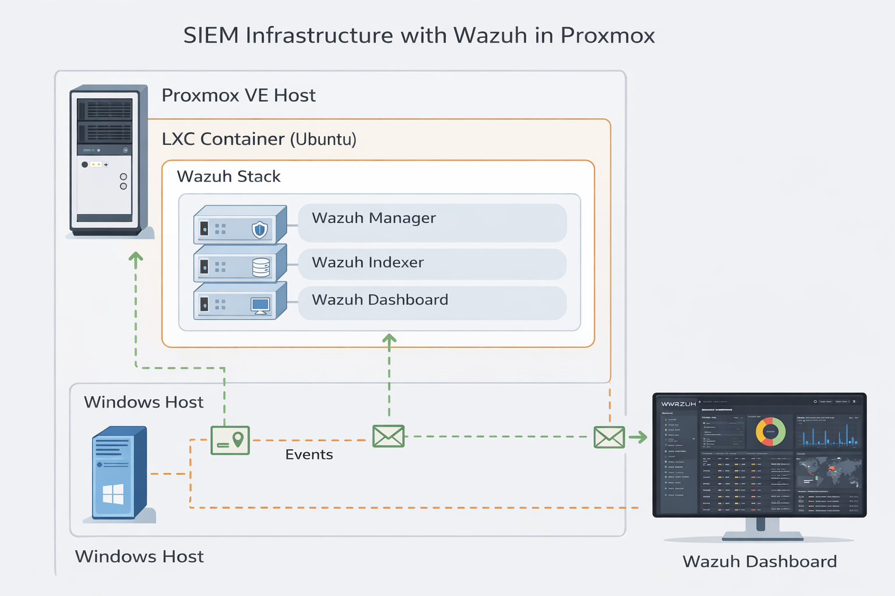
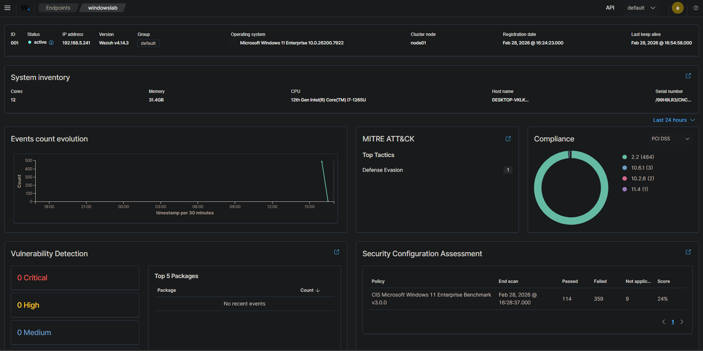

## 🛡️ Implementación de SIEM con Wazuh en Proxmox

### 📌 Descripción

Implementación de plataforma de monitoreo de seguridad utilizando Wazuh desplegado en un contenedor LXC sobre Proxmox VE.

Se configuró:

- Wazuh Manager
- Wazuh Indexer
- Wazuh Dashboard
- Agente Windows conectado y reportando eventos

---

### 🏗️ Arquitectura

---

### 🔐 Funcionalidades Implementadas

- Registro y autenticación de agente Windows
- Monitoreo de eventos de seguridad
- Detección de creación de usuarios locales
- Alertas por intentos fallidos de login
- Visualización de eventos en tiempo real

---
###  Captutas del agente y Dashboard

